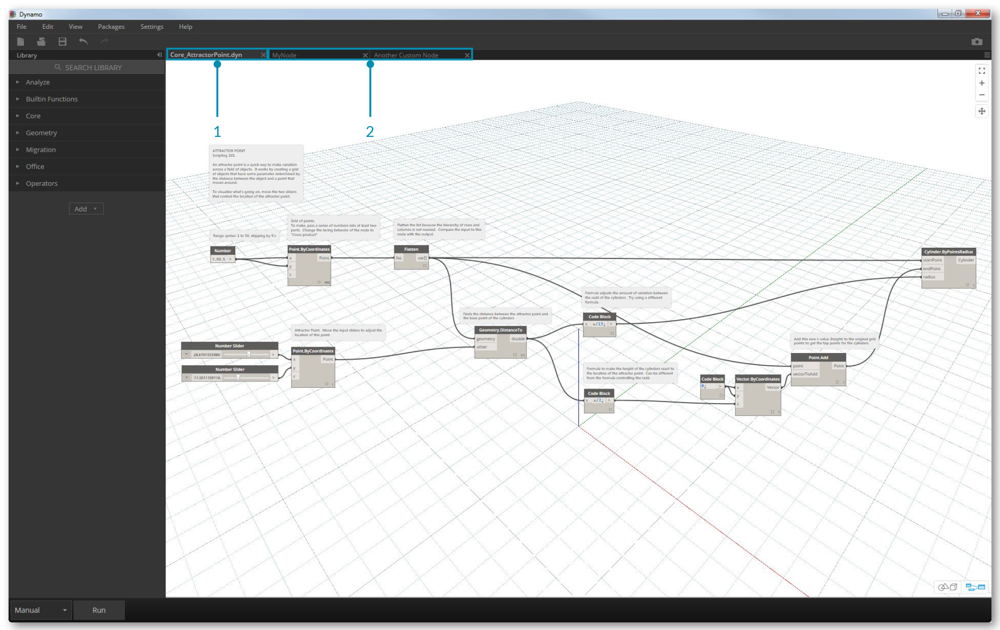
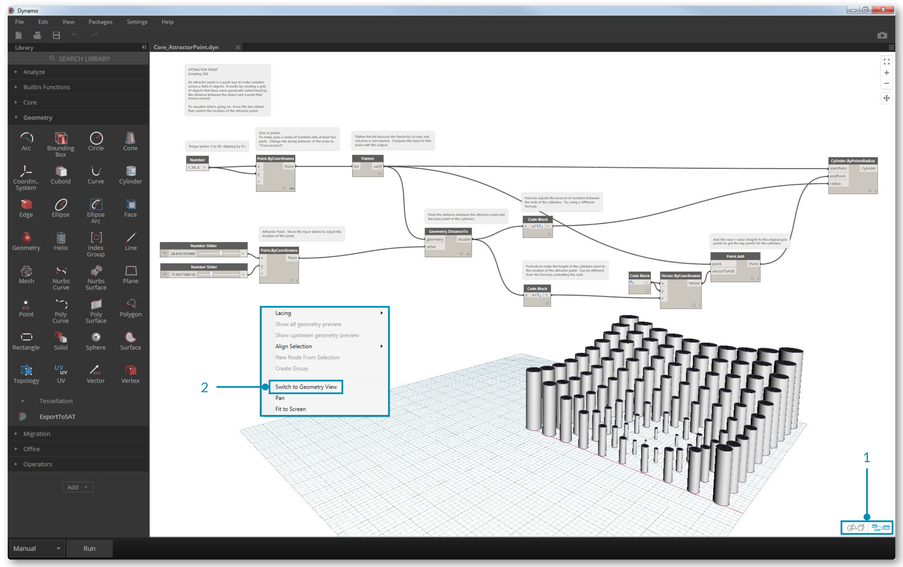
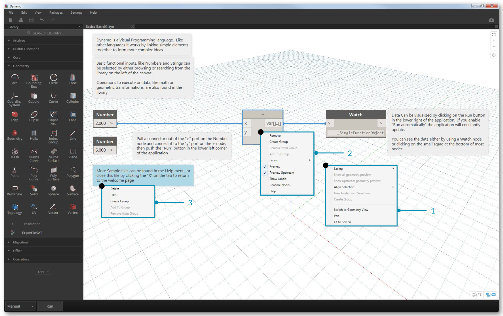

## 工作区

Dynamo中**工作区**使我们开展视觉项目的主要场所，也是我们预览、生成几何的地方。用鼠标或者右上方的按钮可以在主工作区或者视图中展现，在右下角开关模式之间可以快切换我们的预览.

>  注意:节点和几何画有可能呈现在对方前边，有可能迷惑你，添加多个节点在工作区时，会呈现在同一位置。

>1.选项卡

>2.变焦/盘按钮

>3.预览模式

>4.双击工作区

###选项卡

工作选项卡允许你浏览和编辑程序，当你打开一个文件默许你是打开的一个新的**Home**工作区，你也可以打开一个新的*自定义节点工作区从文件菜单打开*新节点右键北选中（edit功能）.

> 注意:你只可以打开一个工作区;不过,您可能打开多个自定义节点.

###3D预览图和导航

在Dynamo中，在工作区呈现的是图和三维图（我们创建的模型），默认情况下图是活跃的，可以使用导航按钮活鼠标中间平移和缩放图，来切换、预览等实现。

> 1.在工作区中预览切换按钮

> 2.在工作区中右键单击并选择*开关……预览*

> 3.键盘快捷键(Ctrl + B)

###鼠标

根据预览模式被激活时,你的鼠标按钮将不同。一般来说,左击鼠标选择并指定输入,右击鼠标给访问选项,中间鼠标点击允许您导航工作区。右击鼠标将我们选择基于我们点击的上下文。

> 1.右键单击工作区

> 2.右键单击一个节点

> 3.右键单击

这里有一个鼠标交互/预览表:

**鼠标操作 ** | **图预览** | **3D 预览**
--- | --- | ---
左单击 | 选择 | N/A
右单击 | 右键菜单 | 缩放选项
单击中键 | 摇镜头 | 摇镜头
滚动 | 放大/缩小 | 放大/缩小
双击鼠标 | 创建代码块 | N/A

