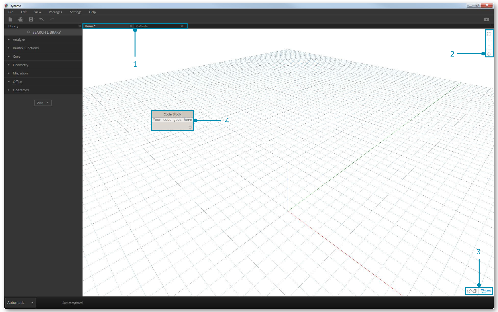

## The Workspace
## 工作区

The Dynamo **Workspace** is where we develop our visual programs, but it's also where we preview any resulting geometry. Whether we are working in a Home Workspace or a Custom Node, we can navigate with our mouse or the buttons at top right. Toggling between modes at bottom right switches which preview we navigate.

Dynamo中**工作区**使我们开展视觉项目的主要场所，也是我们预览、生成几何的地方。用鼠标或者右上方的按钮可以在主工作区或者视图中展现，在右下角开关模式之间可以快切换我们的预览.

> Note: Nodes and geometry have a draw order so you may have objects rendered on top of each other. This can be confusing when adding multiple nodes in sequence as they may be rendered in the same position in the Workspace.

>  注意:节点和几何画有可能呈现在对方前边，有可能迷惑你，添加多个节点在工作区时，会呈现在同一位置。

>1. Tabs
>1.选项卡
2. Zoom/Pan Buttons
2.变焦/盘按钮
3. Preview Mode
3.预览模式
4. Double Clicking on the Workspace
4.双击工作区

###Tabs
###选项卡
The active Workspace tab allows you to navigate and edit your program. When you open a new file, by default you are opening a new **Home** Workspace. You may also open a new **Custom Node** Workspace from the File Menu or by the *New Node by Selection* right click option when Nodes are selected (more eon this functionality later).

工作选项卡允许你浏览和编辑程序，当你打开一个文件默许你是打开的一个新的**Home**工作区，你也可以打开一个新的*自定义节点工作区从文件菜单打开*新节点右键北选中（edit功能）.

> Note: You may have only one Home Workspace open at a time; however, you may have multiple Custom Node Workspaces open in additional tabs.

> 注意:你只可以打开一个工作区;不过,您可能打开多个自定义节点.

###Graph versus 3D Preview Navigation
###3D预览图和导航
In Dynamo, the Graph and the 3D results of the Graph (if we are creating geometry) are both rendered in the Workspace. By default the Graph is the active preview, so using the Navigation buttons or middle mouse button to pan and zoom will move us through the Graph. Toggling between active previews can be achieved three ways:

在Dynamo中，在工作区呈现的是图和三维图（我们创建的模型），默认情况下图是活跃的，可以使用导航按钮活鼠标中间平移和缩放图，来切换、预览等实现。

> 1. Preview Toggle Buttons in the Workspace
> 1.在工作区中预览切换按钮
2. Right clicking in the Workspace and selecting *Switch to ... View*
2.在工作区中右键单击并选择*开关……预览*
3. Keyboard shortcut (Ctrl + B)
4.键盘快捷键(Ctrl + B)

###Hello Mouse!
###鼠标

Based on which Preview mode is active, your mouse buttons will act differently. In general, the left mouse click selects and specifies inputs, the right mouse click gives access to options, and the middle mouse click allows you to navigate the Workspace. The right mouse click will present us with options based on the context of where we are clicking.

根据预览模式被激活时,你的鼠标按钮将不同。一般来说,左击鼠标选择并指定输入,右击鼠标给访问选项,中间鼠标点击允许您导航工作区。右击鼠标将我们选择基于我们点击的上下文。

>1. Right Click on the Workspace
>1. 右键单击工作区
2. Right Click on a Node
2.右键单击一个节点
3. Right Click on a Note
3.右键单击

Here's a table of mouse interactions per Preview:

这里有一个鼠标交互/预览表:

**Mouse Action** | **Graph Preview** | **3D Preview**
--- | --- | ---
Left Click | Select | N/A
Right Click | Context Menu | Zoom Options
Middle Click | Pan | Pan
Scroll | Zoom In/Out | Zoom In/Out
Double Click | Create Code Block | N/A

**鼠标操作 ** | **图预览** | **3D 预览**
--- | --- | ---
左单击 | 选择 | N/A
右单击 | 右键菜单 | 缩放选项
单击中键 | 摇镜头 | 摇镜头
滚动 | 放大/缩小 | 放大/缩小
双击鼠标 | 创建代码块 | N/A
