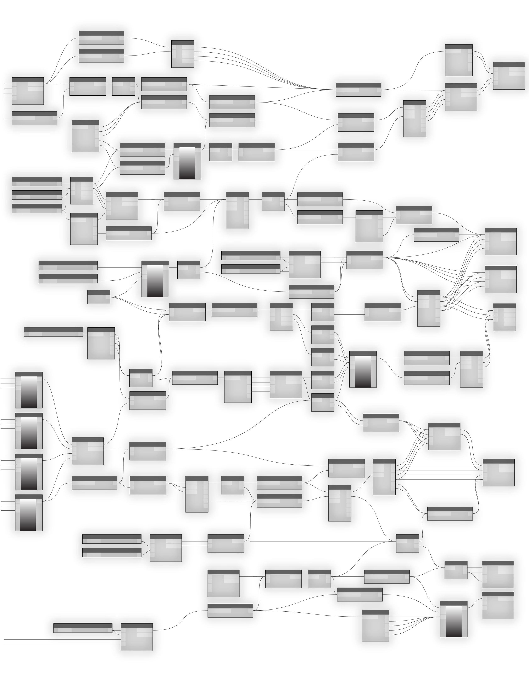

#ANATOMY OF A VISUAL PROGRAM

# 可视化程序分析

Dynamo enables us to create Visual Programs in a Workspace by connecting Nodes with Wires to specify the logical flow of the resulting Visual Program. This chapter introduces the elements of Visual Programs, the organization of the Nodes available in Dynamo's Libraries, the parts and states of Nodes, and best practices for your Workspaces.

我们可以在工作区与线条连接节点创建视觉程序，进行可视化程序的逻辑编程。本章介绍了节点的视觉项目，Dynamo节点、，让你能够尽快的学习.

