##Strings   【字符串】
Formally, a **String** is a sequence of characters representing a literal constant or some type of variable. Informally, a string is programming lingo for text.  We've worked with numbers, both integers and decimal numbers, to drive parameters and we can do the same with text.

###Creating Strings     【创建字符串】
Strings can be used for a wide range of applications, including defining custom parameters, annotating documentation sets, and parsing through text-based data sets. The string Node is located in the Core>Input Category.

> The sample Nodes above are strings.  A number can be represented as a string, as can a letter, or an entire array of text.

###Querying Strings    【查询字符串】
>Download the example file that accompanies this exercise (Right click and "Save Link As..."): [Building Blocks of Programs - Strings.dyn](datasets/4-5/Building Blocks of Programs - Strings.dyn). A full list of example files can be found in the Appendix.

You can parse through large amounts of data quickly by querying strings.  We'll talk about some basic operations which can speed up a workflow and help for software interoperability.

你可以通过大量数据的快速解析查询字符串。我们会讨论一些基本操作,可以加速一个工作流,帮助软件互操作性。

The image below considers a string of data coming from an external spreadsheet.  The string represents the vertices of a rectangle in the XY-Plane.  Let's break down some string split operations in miniature exercise:

下图是一个字符串的数据来自外部的Excel。该字符串代表一个矩形的顶点在xy平面,让我们来联系一些字符串分割操作：

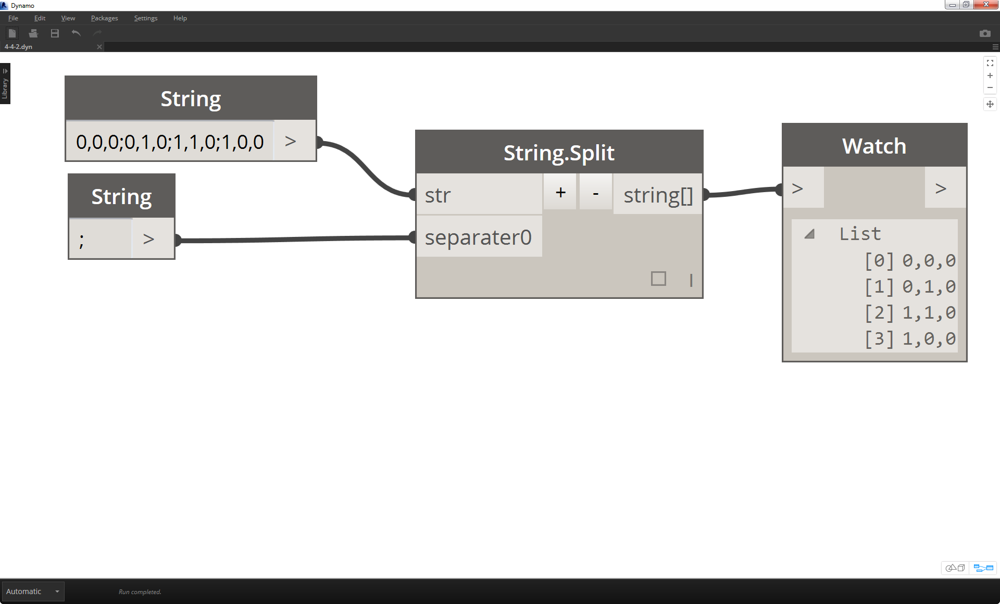
> 1. The ";" separator splits each vertex of the rectangle. This creates a list with 4 items for each vertex.

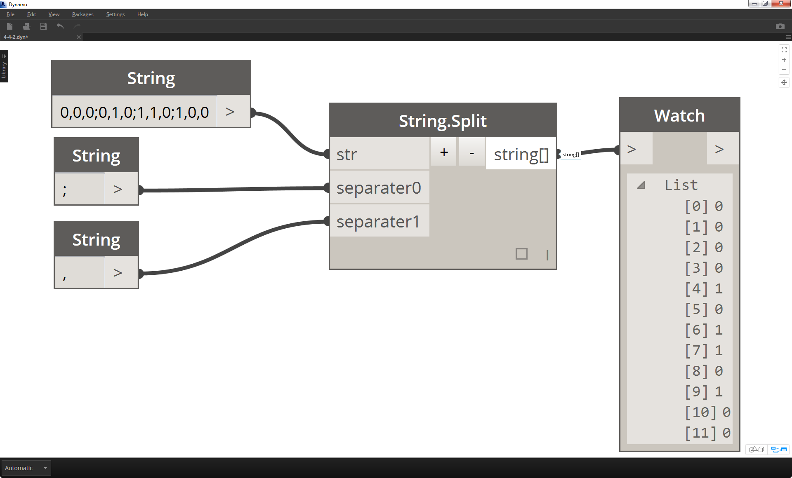
> 1. By hitting the "*+*" in the middle of the Node, we create new separator.
2. Add a "*,*" string to the canvas and plug in to the new separator input.
3. Our result is now a list of ten items. The Node first splits based on *separator0*, then based on *separator1*.

While the list of items above may look like numbers, they are still regarded as individual strings in Dynamo. In order to create points, their data type needs to be converted from a string to a Number. This is done with the String.ToNumber Node

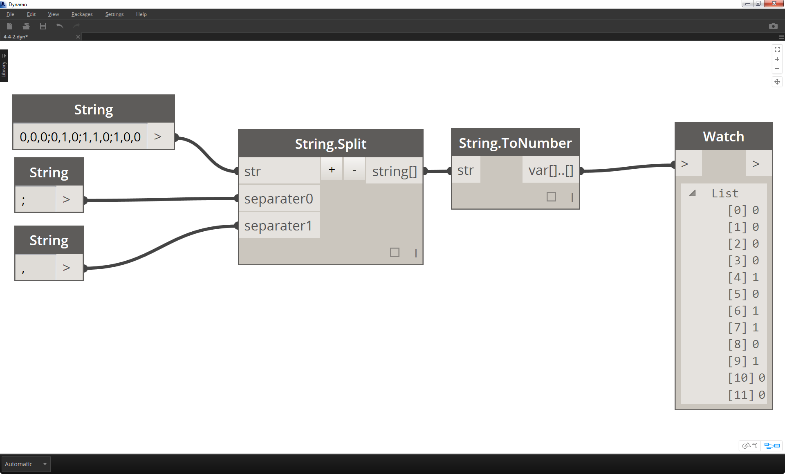
> 1. This Node is straightforward.  Plug the String.Split results into the input.  The output doesn't look different, but the data type is now a *number* instead of a *string*.

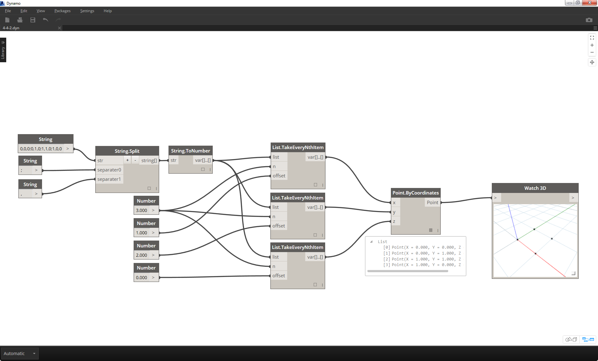
> 1. With some basic additional operations, we now have a rectangle drawn at the origin based on the original string input.

###Manipulating Strings    【操作字符串】
Since a string is a generic text object, they host a wide range of applications.  Let's take a look at some of the major actions in the Core>String Category in Dynamo:

一个字符串是一个通用的文本对象,它们是一个很广泛的exe(应用程序)。让我们看看一些主要的行动，在Dynamoz核心中的应用>字符串:

This is a method of merging two strings together in order. This takes each literal string in a list and creates one merged string.

这是一个方法,将两个字符串合并在一起。这需要每个列表，合并创建一个字符串。

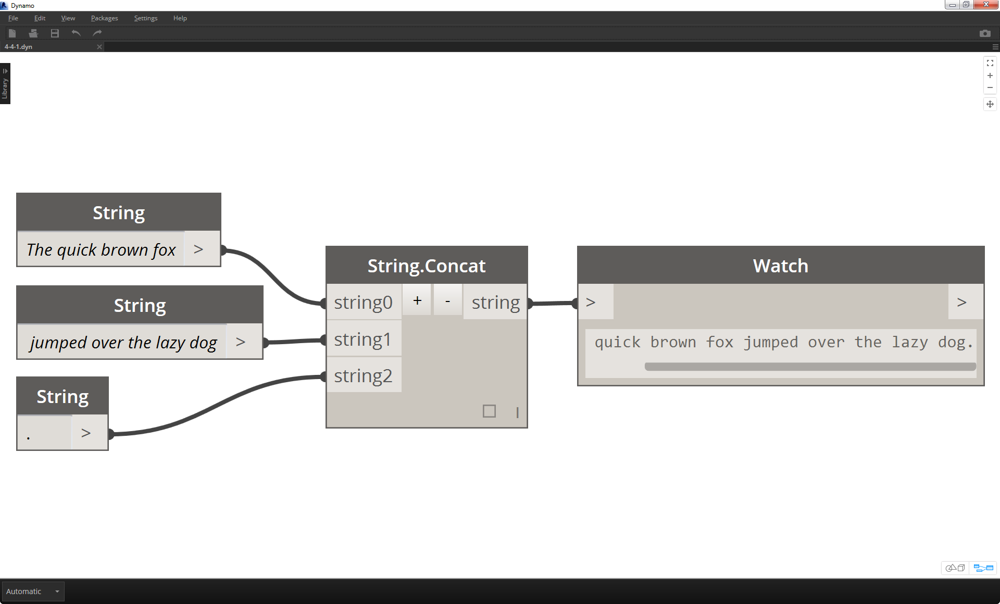
> The image above represents the concatenation of three strings:
1. Add or subtract strings to the concatenation by clicking the +/- buttons int he center of the Node.
2. The output gives one concatenated string, with spaces and punctuation included.

The join method is very similar to concatenate, except it has an added layer of punctuation.

连接方法连接非常相似,除了它需要额外的标点符号【；】

If you've worked in Excel, you may have come across a CSV file.  This stands for comma-separated values.  One could use a comma (or in this case, two dashes) as the separator with the join Node in order to create a similar data structure:
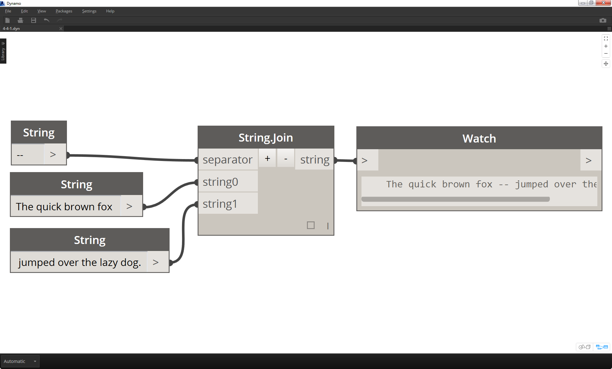
> The image above represents the joining of two strings:
1. The separator input allows one to create a string which divides the joined strings.

###Working with Strings     【处理字符串】
In this exercise, we're going to use methods of querying and manipulating strings to deconstruct the final stanza of Robert Frost's [Stopping By Woods on a Snowy Evening](http://www.poetryfoundation.org/poem/171621).  Not the most practical application, but it will help us to grasp conceptual string actions as we apply them to legible lines of rhythm and rhyme.

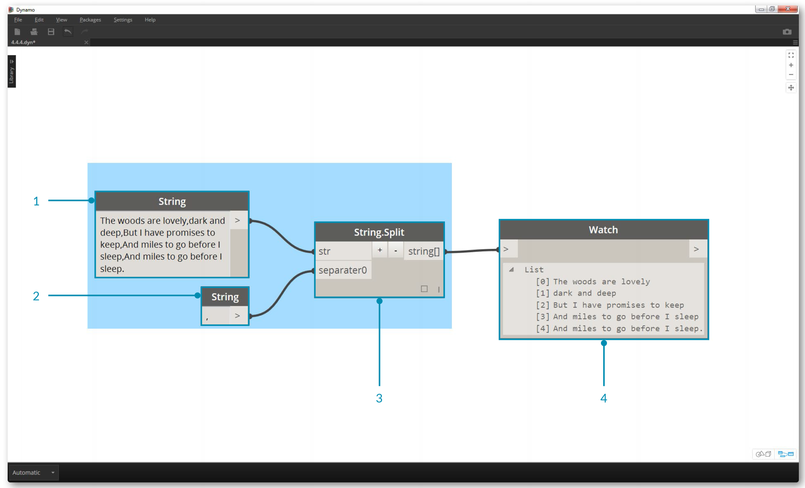
> Let's begin with a basic string split of the stanza.  We first notice that the writing is formatted based on commas.  We'll use this format to separate each line into individual items.
1. The base string is pasted into a string node.
2. Another string node is used to denote the separator.  In this case, we're using a comma.
3. A String.Split Node is added to the canvas and connected to the two strings.
4. The output shows that we've now separated the lines into individual elements.

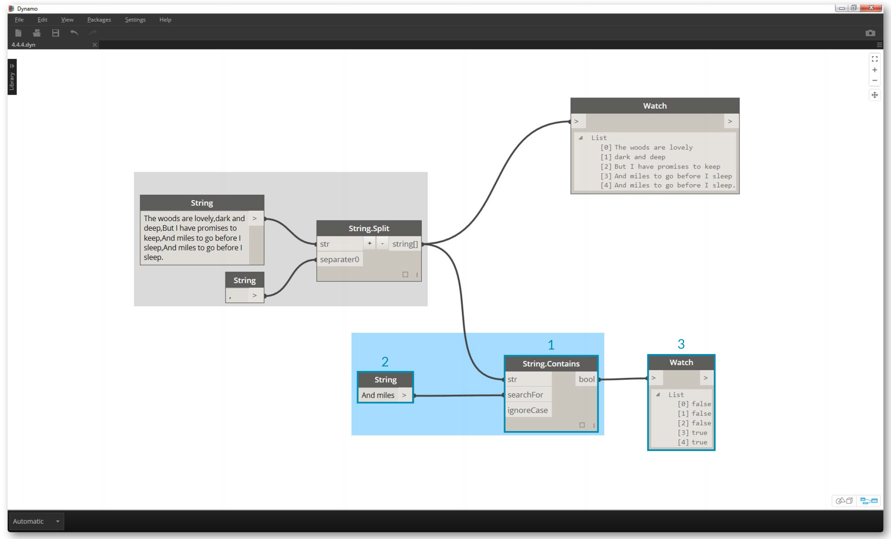
> Now, let's get to the good part of the poem: the last two lines.  The original stanza was one item of data.  We separated this data into individual items in the first step. Now we need to do a search for the text we're looking for. And while we *can* do this by selecting the last two items of the list, if this were an entire book, we wouldn't want to read through everything and manually isolate the elements.
1. Instead of manually searching, we use a String.Contains Node to perform a search for a set of characters.  This is the similar to doing the "Find" command in a word processor.  In this case, we get a return of "true" or "false" if that substring is found within the item.
2. In the "searchFor" input, we define a substring that we're looking for within the stanza. Let's use a string node with the text "And miles".
3. The output gives us a list of falses and trues.  We'll use this boolean logic to filter the elements in the next step.

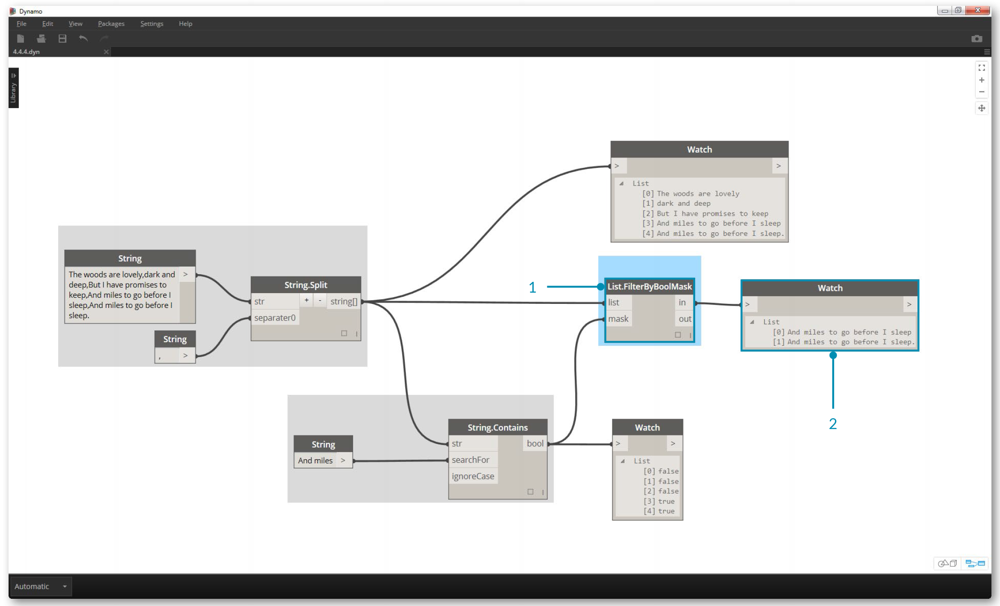
>1. List.FilterByBoolMask is the Node we want to use to cull out the falses and trues.  The "in" output return the statements with a "mask" input of "true, while the "out" output return those which are "false".
2. Our output from the "in" is as expected, giving us the final two lines of the stanza.

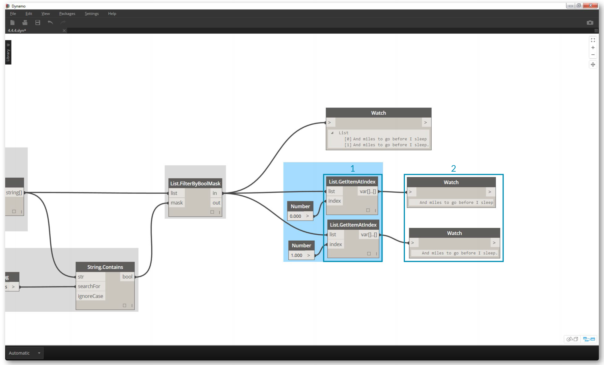
>Now, we want to drive home the repetition of the stanza by merging the two lines together.  When viewing the output of the previous step, we notice that there are two items in the list:
1. Using two List.GetItemAtIndex Nodes, we can isolate the items using the values of 0 and 1 as the index input.
2. The output for each Node gives us, in order, the final two lines.

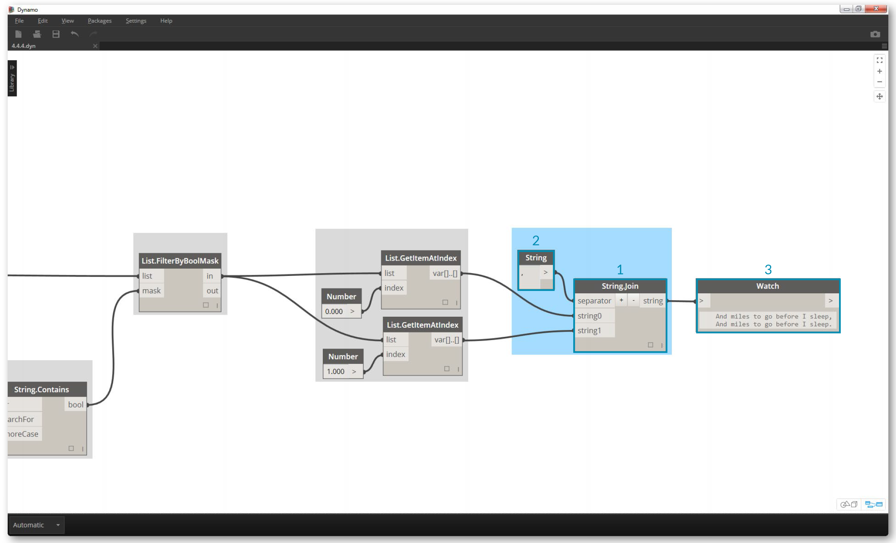
>To merge these two items into one, we use the String.Join Node:
1. After adding the String.Join Node, we notice that we need a separator.
2. To create the separator, we add a string node to the canvas and type in a comma.
3. The final output has merged the last two items into one.

This may seem like a lot of work to isolate the last two lines; and it's true, string operations often require some up front work.  But they are scalable, and they can be applied to large datasets with relative ease.  If you are working parametrically with spreadsheets and interoperability, be sure to keep string operations in mind.

