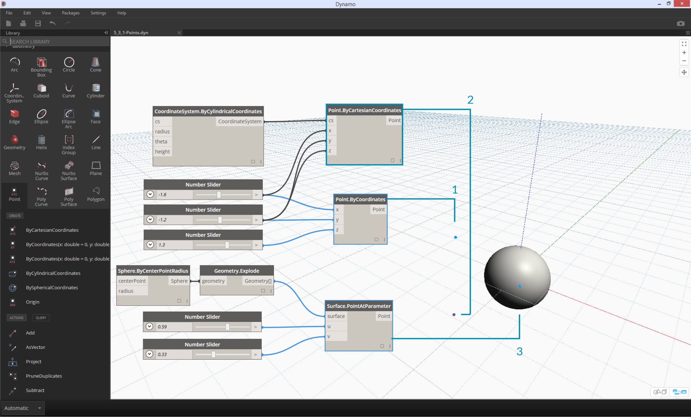

## Points
##Dynamo 中的点.
If Geometry is the language of a model, then Points are the alphabet. Points are the foundation upon which all other geometry is created - we need at least two Points to create a Curve, we need at least three Points to make a Polygon or a Mesh Face, and so on. Defining the position, order, and relationship among Points (try a Sine Function) allows us to define higher order geometry like things we recognize as Circles or Curves.

点是所有创建几何的基础，我们至需要两个点来创建一个曲线，需要三个点来创建多边形或网状的异形.他的位置、定义、顺序和点之间的关系能够定义出更高的异形曲面或曲体.


>1. A Circle using the functions ```x=r*cos(t)``` and ```y=r*sin(t)```
>1. 圆使用的功能 ```x=r*cos(t)``` and ```y=r*sin(t)```
2. A Sine Curve using the functions ```x=(t)``` and ```y=r*sin(t)```
2. 正弦曲线使用功能 ```x=(t)``` and ```y=r*sin(t)```
### What's a Point?
### 点的定义

A Point is defined by nothing more than one or more values called coordinates. How many coordinate values we need to define the Point depends upon the Coordinate System or context in which it resides. The most common kind of Point in Dynamo exists in our three-dimensional World Coordinate System and has three coordinates [X,Y,Z].

一个点被定义为一个或多个值时，被称为坐标，需要定义多少坐标值点取决于他所在坐标的数值，最常见的点在Dynamo中三维世界坐标系统和有三个坐标值（x,y,z）.


### Point as Coordinates
### 点的坐标

Points can exist in a two-dimensional Coordinate System as well. Convention has different letter notation depending upon what kind of space we are working with - we might be using [X,Y] on a Plane or [U,V] if we are on a surface.

点也可以存在于一个二维坐标系统。公约有不同的字母符号取决于什么样的空间我们正在与——我们可能会使用在飞机上(X,Y)或(U,V)如果我们是在一个表面上。

点可以存在于一二维坐标系统，不同的字母符号取决于不同的空间，我们正在使用在同一表面上不同统一坐标系（x,y）或（u,v）之间的关系.


> 1. A Point in Euclidean Coordinate System: [X,Y,Z]
> 1. 一个点在几何坐标系统: [X,Y,Z]
> 2. A Point in a Curve Parameter Coordinate System: [t]
> 2. 一个点在一条曲线参数坐标系统: [t]
> 3. A Point in a Surface Parameter Coordinate System: [U,V]
> 3. 一个点在一个表面参数坐标系统: [U,V]


Although it might seem counter intuitive, Parameters for both Curves and Surfaces are continuous and extend beyond the edge of the given geometry. Since the shapes that define the Parameter Space reside in a three-dimensional World Coordinate System, we can always translate a Parametric Coordinate into a "World" Coordinate. The point [0.2, 0.5] on the surface for example is the same as point [1.8, 2.0, 4.1] in world coordinates.

虽然它似乎是反直觉的,参数曲线和表面都是连续和超越给定的几何形状的边缘。自定义形状参数空间驻留在一个三维世界坐标系统,我们可以将参数坐标转化为一个“世界”的坐标。表面上的点[0.2,0.5]例如是一样的点(1.8,2.0,4.1)在世界坐标。

参数曲线和表面都是连续和不规则的几何形状，自定义形状参数空间停留在一个三维世界坐标系统，我们可以将参数坐标转化为一个“世界”坐标，表面上的点[0.2,0.5]转化为世界坐标的点[1.8,2.0,4.1].


> 1. Point in assumed World XYZ Coordinates
> 1. 在假定世界坐标中的X,Y,Z
> 2. Point relative to a given Coordinate System (Cylindrical)
> 2. 点相对于给定的坐标系(圆柱)
> 3. Point as UV Coordinate on a Surface
> 3. 点作为UV坐标在一个表面上

>Download the example file that accompanies this image (Right click and "Save Link As..."): [Geometry for Computational Design - Points.dyn](datasets/5-3/Geometry for Computational Design - Points.dyn). A full list of example files can be found in the Appendix.

>下载示例文件,伴随这幅图像(右点击“链接另存为…”):[Geometry for Computational Design - Points.dyn](datasets/5-3/Geometry for Computational Design - Points.dyn).示例文件的完整列表可以在附录中找到.


