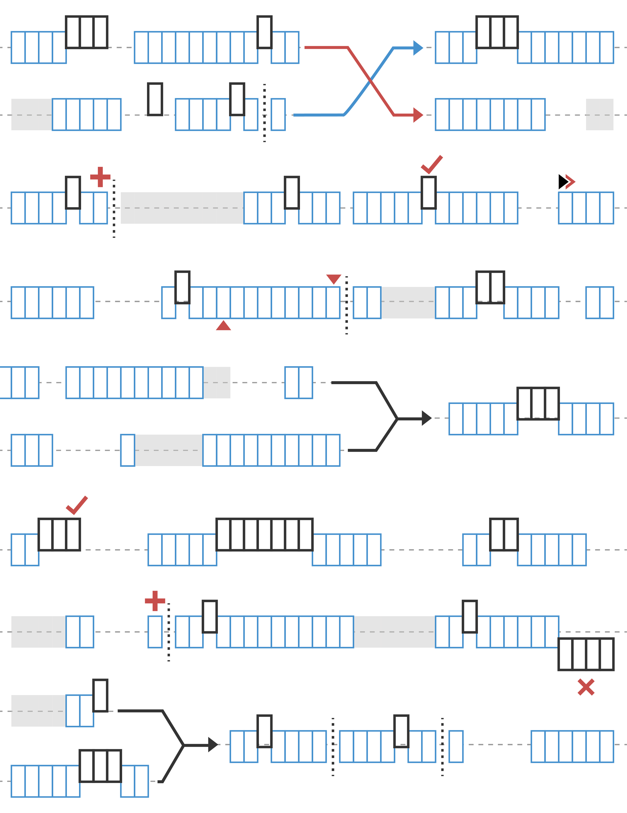

# Designing with Lists
#  List的设计

Lists are the way we organize data.  On your computer's operating system, you have files and folders.  In Dynamo, we can regard these as items and lists, respectively.  Like your operating system, there are many ways to create, modify, and query data. In this chapter, we'll break down how lists are managed in Dynamo.

列表是我们组织数据的方式，在你的计算机上可以通操作系统来组织和编辑你的文件和文件夹，而在Dynamo中，我们是通过项目和列表来控制。操作系有很多种方法可以改变、创建、修改和查询数据，在这一章我们将如何管理在Dynamo中数据List.

